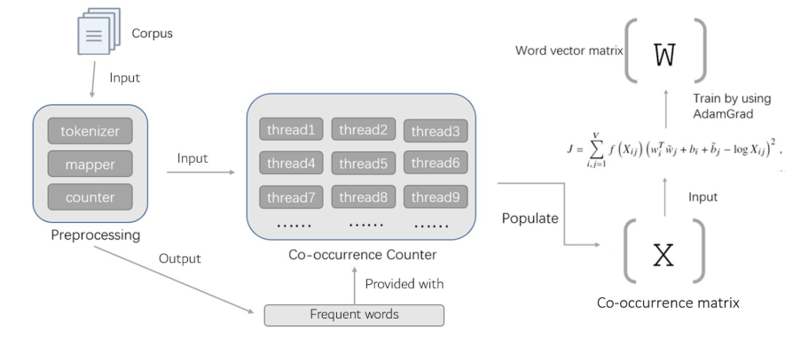
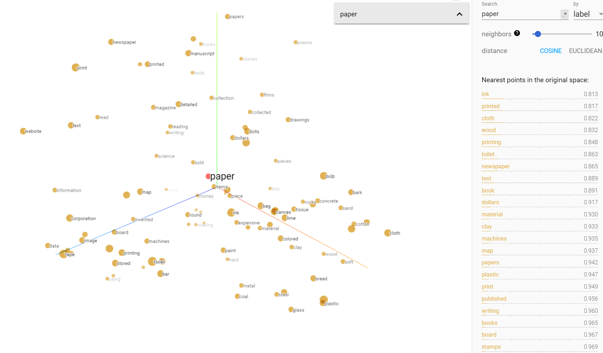

# Implement GloVe word embedding on 10,000 most-frequent words from wiki dump.  TensorFlow version.
1. Implement CPU version word-word co-occurrence statistics. (CPU_co_occur.py)
2. Implement GPU version word-word co-occurrence statistics. (pycuda_wwoc_matrix.py)
3. Train GloVe model using tensorflow. (model.py)

# Project diagram (only for GPU version, CPU version just use one thread in co-occurrence counter)

# Result visualization

# File introduction
## tok.py

Input: text documents wiki_00, wiki_01... in folder ./text/AA

Output: freq_wordlist.csv, wiki_00001token.csv,wiki_00002token.csv ...

Environment: python 3, nltk 

Note: This file is not runnable on server(because of the lack of nltk package), use the uploaded files instead.

## pycuda_wwoc_matrix.py (generate co-occurrence matrix by gpu)

input:freq_word.csv, wiki_00001token.csv,wiki_00002token.csv ..

Input: freq_wordlist.csv, wiki_00001token.csv,wiki_00002token.csv ...

Output: WWOC_matrix_all.csv (2.32 GByte!)

Environment: python 2, CUDA

Note: Code and data are in same folder; Since the output file is quite big, you can output only 10 or 30 lines of them to speedup. If you do this, modify first for-loop in compare.py to compare certain lines. In order to compare all lines, change it to 10000.

If you want to try integer version, comment line 217, uncomment line 221, comment line 255, uncomment lline 256. This will change the atomicAdd: instead of adding 1/distance, it will always add 1 when one frequent word appears in the context of another frequent word.

## CPU_co_occur.py (generate co-occurrence matrix by cpu)

input:freq_word.csv, wiki_00001token.csv,wiki_00002token.csv ...

Output:CPU_co_occurMat.csv (2.32 GByte!)

Environment: python 3

Note: Code and data are in same folder, You can directly run this code

If you want to try integer version, comment line 50, uncomment line 51, comment line 55, uncomment lline 56.

## compare.py

Input: WWOC_matrix_all.csv, output of python version of WWOC matrix

Output: Max absolute error rate, average absolute error rate

Environment: python 2, codecs

Note: Code and data are in same folder.

## model.py(training Glove Model)

input: WWOC_matrix_all.csv or CPU_co_occurMat.csv

Output: tensorflow trained model, including several files with extension: checkpoint \ .index \ .meta \ .data- \ .pbtxt,

such as: checkpoint \ my_GloVec.ckpt-16016.data-00000-of-00001\ my_GloVec.ckpt-16016.index \ my_GloVec.ckpt-16016.meta \ projector_config.pbtxt

Environment: python 3, tensorflow 1.4.0

Note: You can directly run this file after you get WWOC_matrix_all.csv or CPU_co_occurMat.csv under the same directory as this file

## model_test.py (model result test)

Input: tensorflow model, file should be modified when you get a new model

Output: test result for the model

Note: can only be run after training model and modifying the path within this file

## metadata.tsv 

For visualization in tensorboard
